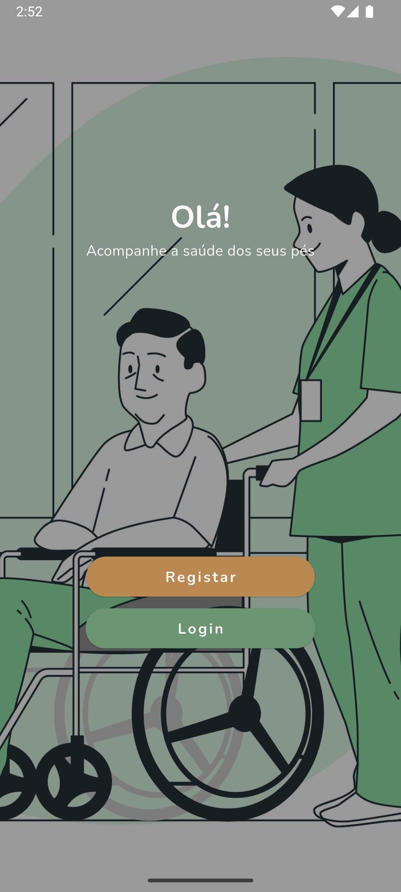
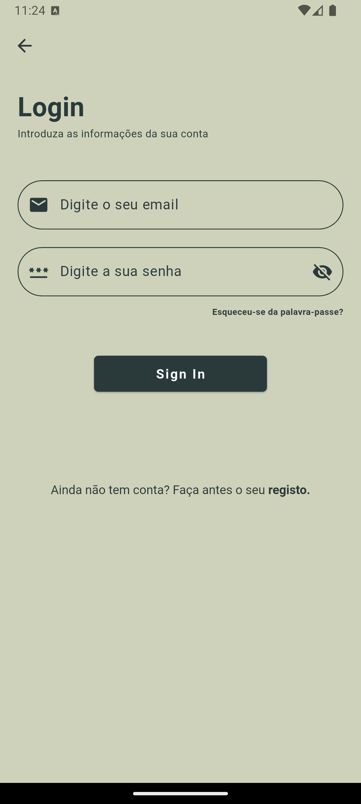
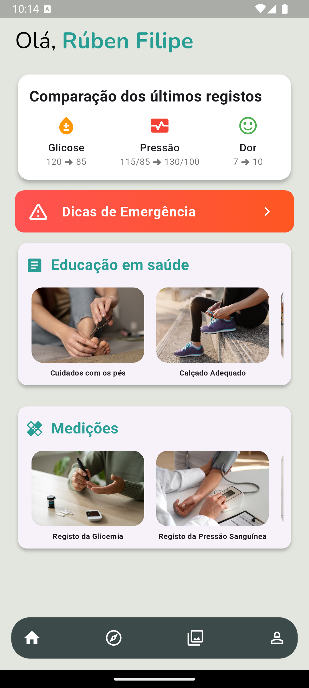
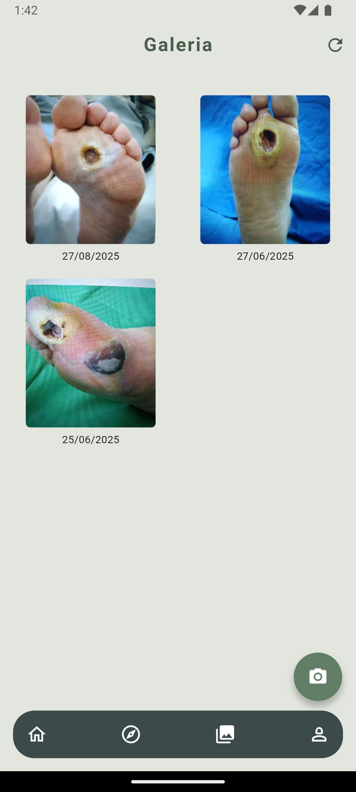
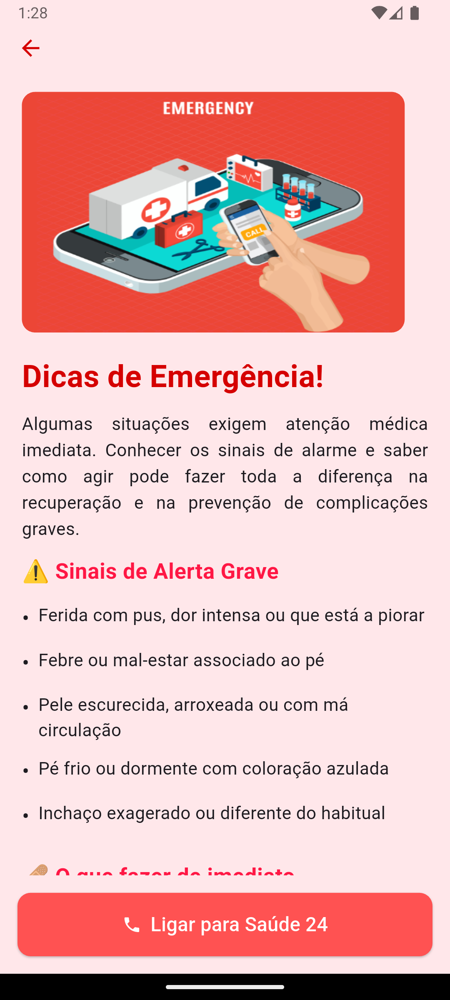
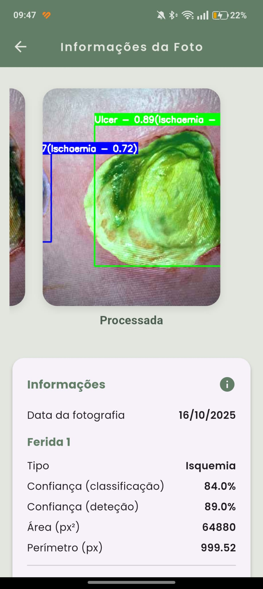

# Diabetic Foot Monitoring App

This repository contains part of the practical work developed during my Master’s Thesis in Medical Informatics.

The project consists of a mobile application developed with Flutter for diabetic foot monitoring and patient follow-up. The application allows users to:

- Record and monitor clinical metrics
- View historical health records
- Upload diabetic foot images for wound evolution tracking
- Access educational information
- Analyze health metrics over time
- Communicate with healthcare professionals

The system integrates a REST API for data storage and processing, as well as Firebase services for authentication and real-time features.

## Technologies Used

- Flutter
- Dart
- Firebase
- REST APIs
- Mobile Development

## Repository Notice

For security, privacy and infrastructure protection reasons, this public repository only includes the `lib/` directory, containing the application pages and UI components.

Sensitive configurations, credentials, backend services and private infrastructure components are intentionally excluded.

## Screenshots

  
  
  
  
  
  

